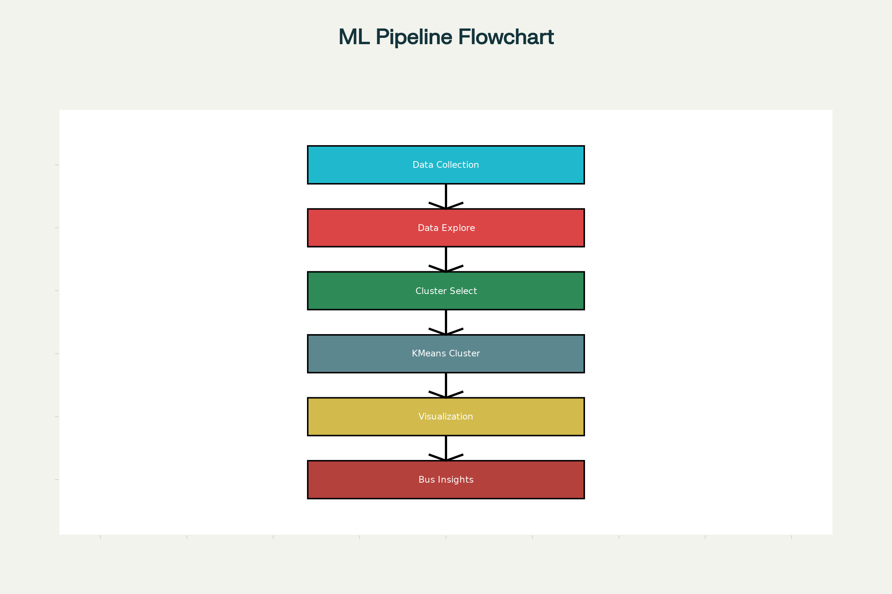

# KMeans Clustering - Mall Customer Segmentation Project

## Project Overview
This project implements a comprehensive K-means clustering algorithm to segment customers of a retail store based on their demographic and spending characteristics. The analysis uses the Mall_Customers dataset to identify distinct customer groups for targeted marketing strategies and business insights.

## Objective
To create a K-means clustering algorithm that groups customers of a retail store based on:
- Age demographics
- Annual income levels  
- Spending score patterns
- Gender distribution

This segmentation enables businesses to:
- Develop targeted marketing campaigns
- Optimize product offerings for different customer groups
- Improve customer retention strategies
- Make data-driven business decisions

## Project Flowchart



The above flowchart illustrates the complete machine learning pipeline implemented in this project, from data loading and preprocessing through clustering analysis and visualization.

## Dataset Description
The project uses the Mall_Customers.csv dataset containing:
- 200 customer records with no missing values
- 5 features:
  - **CustomerID**: Unique identifier for each customer
  - **Gender**: Male/Female classification
  - **Age**: Customer age (18-70 years)
  - **Annual Income (k$)**: Income in thousands of dollars (15k-137k)
  - **Spending Score (1-100)**: Spending behavior rating

### Dataset Statistics:
- **Mean Age**: 38.85 years
- **Mean Annual Income**: $60.56k
- **Mean Spending Score**: 50.2
- **Gender Distribution**: Balanced between Male and Female customers

## Methodology

### 1. Data Exploration and Analysis
- **Data Quality Check**: Verified no missing values across all features
- **Statistical Analysis**: Generated descriptive statistics for all numerical features
- **Visualization**: Created comprehensive plots including:
  - Pairplots for feature relationships
  - Gender distribution analysis
  - Histograms for feature distributions
  - Correlation analysis using regression plots
  - Violin and swarm plots for gender-based feature analysis

### 2. Optimal Cluster Selection
- **Elbow Method**: Applied to determine optimal number of clusters
- **Silhouette Analysis**: Used silhouette scoring for cluster validation
- **Multiple Feature Combinations**: Tested clustering on:
  - Age vs Spending Score (4 clusters)
  - Annual Income vs Spending Score (5 clusters)
  - Age, Annual Income, and Spending Score combined (6 clusters)

### 3. KMeans Implementation
- **Algorithm**: K-means++ initialization for improved convergence
- **Parameters**:
  - Multiple n_clusters values (1-10) tested
  - max_iter=300 for convergence
  - random_state=111 for reproducibility
  - algorithm='elkan' for efficiency

### 4. Visualization Techniques
- **2D Scatter Plots**: Customer segments with centroid visualization
- **3D Interactive Plots**: Multi-dimensional cluster visualization using Plotly
- **Decision Boundaries**: Cluster regions mapped using mesh grids
- **Color-coded Segments**: Different colors for each identified cluster

## Key Results

### Performance Metrics
- **Elbow Method**: Optimal clusters identified through Within-Cluster Sum of Squares (WCSS) analysis
- **Silhouette Score**: Measures cluster quality and separation
- **Cluster Compactness**: Evaluated using centroid distances

### Customer Segments Identified:

#### Primary Analysis (Annual Income vs Spending Score - 5 Clusters):
1. **Cluster 1**: Low Income, Low Spending
2. **Cluster 2**: Low Income, High Spending
3. **Cluster 3**: High Income, Low Spending
4. **Cluster 4**: High Income, High Spending
5. **Cluster 5**: Average Income, Average Spending

#### Age-Based Analysis (Age vs Spending Score - 4 Clusters):
- **Young High Spenders**
- **Middle-aged Moderate Spenders**
- **Senior Low Spenders**
- **Mixed Age High Spenders**

#### Multi-dimensional Analysis (6 Clusters):
- **Combined age, income, and spending patterns**
- **3D visualization reveals complex customer relationships**
- **Enhanced granularity for targeted marketing**

### Business Insights:
- **Target Segments**: High-income, high-spending customers (Cluster 4) represent premium market
- **Growth Opportunities**: Low-income, high-spending customers (Cluster 2) show potential for loyalty programs
- **Risk Mitigation**: High-income, low-spending customers (Cluster 3) may benefit from engagement campaigns
- **Balanced Approach**: Average customers (Cluster 5) represent stable revenue base

## Technical Implementation

### Libraries Used:
- **pandas**: Data manipulation and analysis
- **numpy**: Numerical computing
- **matplotlib**: Static plotting and visualization
- **seaborn**: Statistical data visualization
- **plotly**: Interactive 3D visualizations
- **scikit-learn**: Machine learning algorithms (KMeans)
- **warnings**: Error handling and cleanup

### Key Features:
- **Robust Data Processing**: Complete data cleaning and validation pipeline
- **Multiple Clustering Approaches**: Various feature combinations tested
- **Visual Analytics**: Comprehensive visualization suite
- **Interactive Elements**: 3D cluster exploration
- **Scalable Design**: Easily adaptable to different datasets

## Files Structure
```
SCT_ML_2/
├── Mall_Customers.csv          # Dataset file
├── task2.ipynb                 # Main analysis notebook
├── ml_pipeline_flowchart.png   # Project workflow diagram
└── README.md                   # Project documentation
```

## Getting Started

### Prerequisites
- Python 3.8 or higher
- Jupyter Notebook or JupyterLab

### Installation

1. **Clone the repository**:
   ```bash
   git clone https://github.com/Jaideep193/SCT_ML_2.git
   cd SCT_ML_2
   ```

2. **Create a virtual environment** (recommended):
   ```bash
   python -m venv venv
   source venv/bin/activate  # On Windows: venv\Scripts\activate
   ```

3. **Install required libraries**:
   ```bash
   pip install -r requirements.txt
   ```

### Usage Instructions

1. **Launch Jupyter Notebook**:
   ```bash
   jupyter notebook
   ```

2. **Open the analysis notebook**:
   - Navigate to `task2.ipynb` in the Jupyter interface
   - Run all cells sequentially (Cell → Run All)

3. **Explore Results**:
   - Review generated visualizations and cluster assignments
   - Examine the clustering metrics and statistics
   - Analyze the customer segments identified

4. **Customize Analysis**:
   - Modify the number of clusters in the KMeans parameters
   - Test different feature combinations
   - Adjust visualization parameters

### Troubleshooting

**Issue**: Module import errors
- **Solution**: Ensure all dependencies are installed: `pip install -r requirements.txt`

**Issue**: Jupyter Notebook not found
- **Solution**: Install Jupyter: `pip install jupyter notebook`

**Issue**: Plotly visualizations not displaying
- **Solution**: Install plotly extensions: `pip install plotly` and restart Jupyter

## Future Enhancements
- **Advanced Algorithms**: Implement DBSCAN, Hierarchical clustering
- **Feature Engineering**: Add derived features like spending ratios
- **Model Validation**: Cross-validation and stability analysis
- **Business Integration**: Connect with CRM systems for real-time segmentation
- **Automated Reporting**: Generate executive dashboards

## Conclusion
This project successfully demonstrates the application of K-means clustering for customer segmentation in retail environments. The comprehensive analysis provides actionable insights for business strategy development, with multiple visualization approaches making the results accessible to both technical and non-technical stakeholders. The identified customer segments enable data-driven decision making for marketing, product development, and customer relationship management initiatives.

## Contributing
Contributions are welcome! Please feel free to submit a Pull Request. For major changes, please open an issue first to discuss what you would like to change.

## License
This project is licensed under the MIT License - see the [LICENSE](LICENSE) file for details.

## Acknowledgments
- Dataset source: Mall Customer Segmentation Data
- Built as part of the SkillCraft Technology Machine Learning Internship Program

## Contact
**Author**: Jaideep193
- GitHub: [@Jaideep193](https://github.com/Jaideep193)

---
*Last Updated: December 2025*

